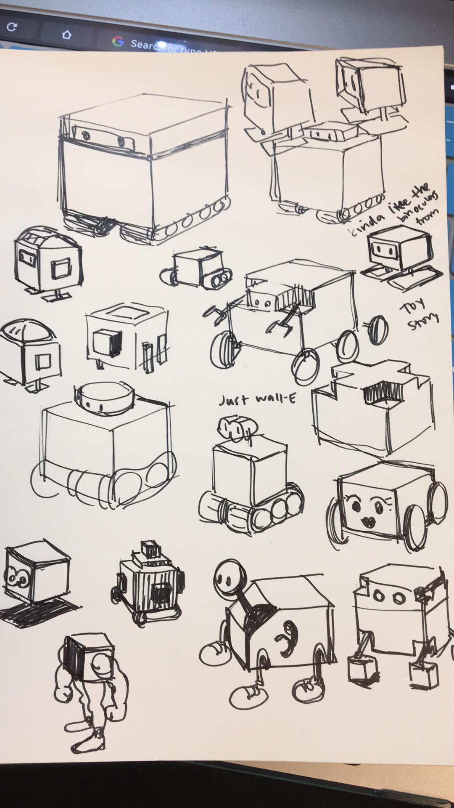
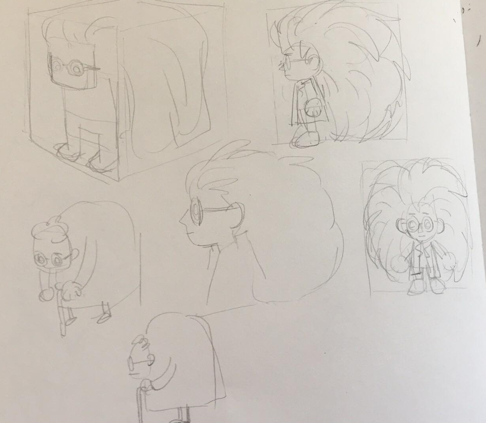

# Laser Lair

In this short game, you play as a mad scientist who has locked herself out of her underground lair. Use your army of robot drones to clear a way through the booby-trapped corridors... of Laser Lair!

Made with ❤ for Stanford's CS248: Interactive Computer Graphics.

# Installation

**Windows:**  
Download the game [here.](http://www.buckbukaty.com/LaserLair_Windows.zip)  
Extract all the contents to the same directory and run `LaserLair.exe`.  

**Mac:**  
Download the game [here.](http://www.buckbukaty.com/LaserLair_Mac.zip)  
Extract all the contents to the same directory and open `LaserLair.app`.  

# Credits
**Design and Engineering:**  
Buck Bukaty - [website](http://www.buckbukaty.com), [github](https://github.com/bbukaty)  
Gabe Saldivar  

**Art and Asset Creation:**  
Katherine Liu - [website](http://www.katherinezliu.com)  
Sofya Ogunseitan - [github](https://github.com/sofya522)  

# Media

